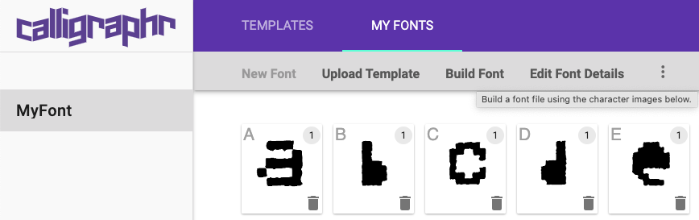

# How to generate the font?

In this document the steps needed to generate and update the font are listed

## Obtain the GPX files

The GPX files represent the GPS tracking of your sport activities. They are usually available in the application you use for that purpose, e.g. Strava, Adidas Runtastic, Nike Running, Garmin, etc.

Place the GPX files to be processed inside the folder `data/gpx`.

## GPX -> SVG conversion

After collecting the GPX files, they need to be converted into a format compatible with font creation. To do so, we will use a `Python` script.

### Python dependencies

The scripts in `Python` require the package `svgutils`. More information:
- https://pypi.org/project/svgutils/
- https://svgutils.readthedocs.io/en/latest/

It can be installed, with the following command:
```
pip install svgutils
```

### Convert files

Once all dependencies installed, you can convert `*.gpx` files into `*.svg` files using the command:
```
python assets/fonts/bin/process.py
```

ℹ️ **Note**: The `process.py` file is designed for the needs of the BCN GPS Art font orientation, you may need to change certain operations to improve the results. Specific knowledge of `Python` and `svgutils` might be required.

In any case, rotation or size can be tuned in future steps

## Create the font

At this point, all SVGs have been generated. Now it is time to generate the font using [Calligraph](https://www.calligraphr.com/).

### Create and fill template

After creating an account, download a template with the characters that you want to create, for example:


The template might look like this:


Place the SVG files in the corresponding square trying to match the size and position of the _shadow_ letters. I used [Inkscape](https://inkscape.org/) for MacOS.


Save the result as PNG.

### Generate the font files

Import the PNG file generated in the previous section back into Calligraphr.

Then, let the tool build the font for you:



This will generate two files:
- `<font-name>.otf`
- `<font-name>.ttf`

### Website optimization

If you try to use these fonts in a website, soon you will discover that some devices do not fully work.


> You should add the files in other formats as well, for example, go to [online web font generator](https://transfonter.org/) and convert your font then add all types because this has to do with the operating system

Source: https://stackoverflow.com/a/55935040

After that your CSS should look like
```css
@font-face {
    font-family: "<font-name>";
    src: url("<font-name>.eot");
    src: url("<font-name>.woff") format("woff"),
    url("<font-name>.otf") format("opentype"),
    url("<font-name>.svg#filename") format("svg");
}
```

In this repository, the `<font-name>` is `Bcngpsart-Regular`
